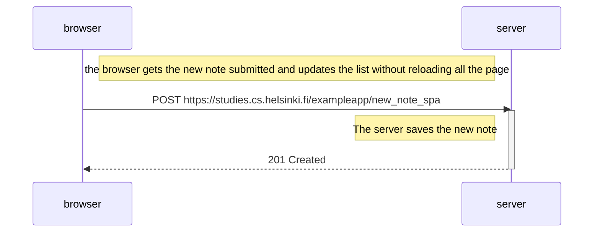

```mermaid
sequenceDiagram
participant browser
participant server

    note right of browser: the browser gets the new note submitted and updates the list without reloading all the page

    browser->>server: POST https://studies.cs.helsinki.fi/exampleapp/new_note_spa

    activate server
    note left of server: The server saves the new note
    server-->>browser: 201 Created
    deactivate server

```
